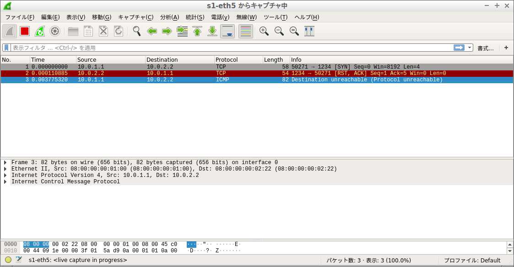

# Insert COPM header after ipv4 header
## Get some error (Resolved)
(Not success `h1 ping h2`. 50% packet loss. <bf>)
(You have to revise this error.)
### Changed
These are p4-tutorials codes. have to need the same code to get interface and to determine src of ethernet header...
```diff_python
+ def get_if():
+     ifs=get_if_list()
+     iface=None # "h1-eth0"
+     for i in get_if_list():
+         if "eth0" in i:
+             iface=i
+             break;
+     if not iface:
+         print("Cannot find eth0 interface")
+         exit(1)
+     return iface
```
```diff_python
- pkt = Ether()
+ pkt = Ether(src=get_if_hwaddr(iface), dst=macdst)
```
You can get the header information whether inserted your defined header or not.
In receive_miu.py:
```diff_python
+ def packet_callback(packet):
+     pkt = bytes(packet)
+     global count
+     IP_PROTO_ICMP = 1
+     IP_PROTO_TCP  = 6
+     IP_PROTO_UDP  = 17
+     IP_PROTO_COMP = 146 ## user defined header
+     
+     HEADER_LENGTH_ETHERNET = 14
+     HEADER_LENGTH_IP       = 20
+     HEADER_LENGTH_ICMP     = 8
+     HEADER_LENGTH_UDP      = 8
+     HEADER_LENGTH_TCP      = 20
+     HEADER_LENGTH_COMP     = 14 ## user defined header
+     
+     print(" ----------------------------------- packet-in -----------------------------------")
+     indent = " "
+     now_indent = indent
+     ## Ethernet header report ## ------------------------
+     pre_pos = 0
+     end_pos = HEADER_LENGTH_ETHERNET
+     eth_report = Ether(pkt[pre_pos:end_pos])
+     eth_report.show2()    
+     ## IPv4 header report ## ------------------------
+     pre_pos = end_pos
+     end_pos += HEADER_LENGTH_IP
+     ip_report = IP(pkt[pre_pos:end_pos])
+     ip_report.show2(lvl=now_indent)
+     
+     if ip_report.proto == TYPE_COMP:
+         ## COMP header report ## ------------------------
+         compType = TYPE_COMP
+         comp_header_count = 1
+         while compType == TYPE_COMP:
+             print("### [COMP HEADER {}] ###".format(comp_header_count))
+             comp_header_count += 1
+             pre_pos = end_pos
+             end_pos += HEADER_LENGTH_COMP
+             comp_report = COMP(pkt[pre_pos:end_pos])
+             for cnt in range(comp_header_count):
+                 now_indent += indent
+             comp_report.show2(lvl=now_indent)
+             compType = comp_report.compType
+         ## TCP header report ## ------------------------
+         if compType == IP_PROTO_TCP:
+             pre_pos = end_pos
+             end_pos += HEADER_LENGTH_TCP
+             tcp_report = TCP(pkt[pre_pos:end_pos])
+             now_indent += indent
+             tcp_report.show2(lvl=now_indent)
+         elif compType == IP_PROTO_UDP:
+             pre_pos = end_pos
+             end_pos += HEADER_LENGTH_UDP
+             udp_report = UDP(pkt[pre_pos:end_pos])
+             now_indent += indent
+             udp_report.show2(lvl=now_indent)
```
If you want to know more detail, see [here](https://forum.p4.org/t/decoding-header-stacks-in-python-scapy/315/2)

## You have to do
You can check only UDP packet.
If send TCP packet, you can not get the correct result, because ACK packets or something are returned at TCP communications like [fig.2](./png/tcp.png). You probably have to consider 1-way packet compression method.<br>

## Debug packet
You can use `send.py` to debug.
```bash
# terminal in host2
python receive_*.py
```
```bash
# terminal in host1
python send.py
```
